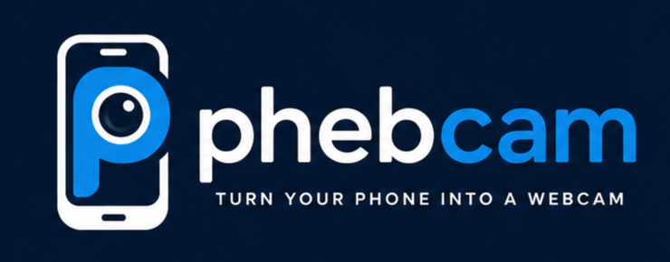

<p align="center">
  
</p>

<h1 align="center">Phebcam</h1>

<p align="center">
  Turn your phone into a wireless webcam.
</p>

Phebcam is a WebRTC-based wireless webcam project that lets a phone
camera be streamed to a PC and exposed to desktop applications through
**OBS Virtual Camera**.

Stream your phone camera to your PC over WebRTC, then use OBS Virtual
Camera to make it available to Zoom, Discord, Google Meet, Teams, and
other applications.

This is a small personal/portfolio project. It does not claim zero
latency, guaranteed connectivity across arbitrary networks, or
production-grade reliability. See [Limitations](#limitations).

---

## Architecture

```
Phone
  |   getUserMedia() -> camera track
  v
WebRTC PeerConnection
  |   direct peer-to-peer media (audio disabled, video only)
  v
Phebcam Viewer (PC browser)
  |   rendered in an OBS Browser Source
  v
OBS Browser Source
  |
  v
OBS Scene -> OBS Virtual Camera
  |
  v
Zoom / Discord / Google Meet / Teams / any app that can pick a camera
```

Signaling (offer/answer/ICE candidate exchange) travels through a small
Node.js/Express/Socket.IO server, scoped by a **room code** so multiple
phone↔PC pairs can use the same server without crosstalk. Once the WebRTC
connection is established, video flows **directly** between the phone and
the PC — the server never sees or stores the video itself.

**Important:** Phebcam's responsibility ends at delivering the video
stream to the PC browser. It does not implement a fake/virtual camera
driver and does not attempt to make the browser appear as a native
Windows/macOS/Linux camera device — that would require OS-specific driver
code and break the project's simplicity. **OBS** (specifically its Browser
Source + built-in Virtual Camera feature) handles turning a browser tab
into something other apps can select as a camera. This is intentional: it
keeps Phebcam simple and cross-platform.

## How to use

1. **On your phone:** open Phebcam, tap **Use Phone as Webcam**. A room
   code is generated (e.g. `ABC123`) and you land on the camera page.
2. Tap **Start Camera**. Your browser will prompt for camera permission.
   Once granted, you'll see your own preview and a status of "Waiting for
   PC...".
3. **On your PC:** open Phebcam, click **I'm on the PC**, and enter the
   room code from your phone (or open
   `http://<server>/viewer.html?room=ABC123` directly).
4. The phone and PC exchange a WebRTC offer/answer and ICE candidates via
   the signaling server. Once connected, the phone's camera video appears
   full-frame in the PC viewer, with its actual resolution and (when
   available) frame rate shown below the video.
5. **In OBS:**
   - Add a **Browser Source** to a scene.
   - Use the **OBS Mode** button on the viewer page (or the "Copy OBS
     URL" button under "Use Phebcam in OBS") to get a chrome-free URL
     like `viewer.html?room=ABC123&obs=true`, and paste that into the
     Browser Source.
   - Set the Browser Source's width/height to roughly match the phone's
     video resolution shown in the viewer.
   - Select that source in your scene, then click **Start Virtual
     Camera** in OBS.
   - In Zoom/Discord/Meet/Teams/etc., select **OBS Virtual Camera** as
     the camera device.
6. Tap **Stop Camera** on the phone at any time to stop sharing. This
   fully releases the camera hardware and notifies the PC viewer
   immediately.

## OBS setup (detailed)

```
Phebcam Viewer  →  OBS Browser Source  →  OBS Scene  →  Start Virtual Camera  →  Zoom / Discord / Meet / Teams
```

1. Open OBS.
2. In your scene, click **+** under Sources, choose **Browser**.
3. Paste the OBS-mode viewer URL (see step 5 above). This URL hides all
   Phebcam navigation/status chrome and shows only the video, so the
   Browser Source captures a clean feed.
4. Set the Browser Source's width and height. Match your phone's actual
   video resolution (shown in the PC viewer's info bar) for the sharpest
   result — mismatched dimensions will letterbox or crop.
5. Arrange/select the Phebcam source in your scene as needed.
6. Click **Start Virtual Camera** in OBS's Controls panel.
7. In any app that lets you choose a camera, select **OBS Virtual
   Camera**.

Applications never talk to Phebcam directly — they only ever see "OBS
Virtual Camera" as a normal system camera device, because OBS is what
exposes that device, not Phebcam.

## Room codes

- The phone creates a session and receives a short random room code.
- The PC viewer joins that same room by entering the code.
- Signaling messages are relayed only within a room, so one phone/PC pair
  never receives another pair's signaling data.
- Rooms are in-memory on the server and require no account or login.

## Video info shown in the viewer

- **Resolution** — read directly from the video element's
  `videoWidth`/`videoHeight` once the phone's stream is playing. Updates
  automatically if the phone rotates or otherwise changes its video
  dimensions.
- **Frame rate** — read from WebRTC's `getStats()` inbound-rtp report
  (`framesPerSecond`) when the browser reports it. If it isn't available,
  the viewer does not display a fabricated number.
- **Connection / ICE state** — reflects the real
  `RTCPeerConnection.connectionState` / `iceConnectionState` values. No
  latency figure is shown because it isn't measured; Phebcam does not
  claim "0 ms latency" or any other unmeasured number.

## Networking: STUN, TURN, and why streaming might fail

- **STUN** helps a peer discover its own publicly reachable network
  address so the other side can potentially connect directly.
- **TURN** relays media when a direct peer-to-peer connection isn't
  possible at all (common across different networks/strict NATs).

**Phebcam currently ships with `iceServers: []`** — no STUN or TURN
configured.

- **Same network / local testing**: supported, where the browser's
  security requirements are met (see the note on HTTPS/localhost below).
- **Different networks**: may fail without a TURN relay. In that case the
  viewer/phone connection state will show "Connecting..." and eventually
  "failed" — this is expected given the current configuration, not a
  signaling bug.

If you add TURN later, pass credentials via environment variables into
the server and have the server hand the client a short-lived
configuration — never hardcode TURN credentials in the client-side code.

> Most browsers only allow camera access on `https://` or on `localhost`.
> Opening the phone camera page over plain `http://<lan-ip>` will likely
> be blocked. Serve over HTTPS (e.g. via a reverse proxy or a tool like
> `ngrok`) if you need real phone-to-PC testing across devices on your
> LAN.

## Privacy

- Camera access on the phone requires explicit browser permission —
  nothing starts automatically on page load.
- Video is transmitted using WebRTC, directly between the phone and the
  PC browser.
- The signaling server handles only signaling messages (SDP
  offer/answer, ICE candidates) required to establish the connection.
- The server does not store camera recordings, and does not receive the
  video stream itself.
- No recording occurs unless you explicitly record through another
  application, such as OBS.
- Tapping "Stop Camera" immediately stops all local media tracks and
  closes the peer connection; the camera hardware is released.

## Setup

Requires Node.js 18+.

```bash
git clone <this-repo-url>
cd phebcam
npm install
npm start
```

Then open `http://localhost:3000` on the machine that will act as your
PC/viewer, and open the same address from your phone's browser (on the
same network, or via a tunneling tool for HTTPS — see Networking above).

```bash
npm run dev     # auto-restart on file changes
PORT=8080 npm start   # override the default port (3000)
```

## Automated tests

```bash
npm test
```

Runs (with the server already running separately, or standalone for the
signaling/edge-case suites which start their own client connections):

- `tests/test-static-structure.js` — verifies every DOM id referenced in
  each page's inline script actually exists in that page's HTML, that no
  duplicate ids exist, that the camera never auto-starts, and that no
  TURN credentials are hardcoded server-side.
- `tests/test-signaling.js` — join flow, offer/answer/ICE relay within a
  room, camera-stopped notification, cross-room isolation.
- `tests/test-edge-cases.js` — rejection of invalid/missing room codes
  and invalid roles.

All three suites currently pass (24/24 checks). See
[`TESTING.md`](./TESTING.md) for the full manual checklist covering the
real phone → OBS → virtual camera workflow, and which parts of that
workflow have and haven't actually been verified end-to-end.

## Limitations

- **One phone camera per room** is the intended/tested case. The
  signaling layer can hand multiple viewers their own offer/answer
  exchange with the camera, but this hasn't been load-tested with many
  simultaneous viewers.
- **Rooms are in-memory only** — restarting the server clears all active
  room state.
- **No authentication** — anyone with a room code can join it. Room codes
  are short random strings, not access-controlled; treat this as a
  casual/local tool, not something for sensitive use.
- **No TURN server configured by default**, so connections across
  restrictive or mismatched networks may fail.
- **Reconnection is automatic at the socket level** (Socket.IO retries
  the signaling connection), but a dropped WebRTC peer connection itself
  is not automatically re-established — the UI clearly reflects a
  disconnected/reconnecting state, and rejoining the room (e.g. via
  refresh) re-triggers the offer/answer flow.
- **Frame rate display** depends on the browser actually reporting
  `framesPerSecond` via `getStats()` — not all browsers/versions do, in
  which case the FPS field is simply left blank rather than guessed.
- This is a portfolio/learning project, not a hardened, production video
  platform.

## Project structure

```
phebcam/
├── index.js                 Signaling server (Express + Socket.IO, room-based relay)
├── package.json
├── public/
│   ├── index.html             Landing page (phone-as-webcam positioning)
│   ├── phone.html              Mobile-optimized camera page
│   ├── viewer.html             Desktop-optimized PC viewer + OBS instructions + OBS mode
│   ├── style.css                Shared styling (distinct phone/viewer layouts)
│   ├── manifest.json             Web app manifest (name, icon, theme color)
│   └── assets/                   Brand assets — see below
│       ├── logo.png                Full wordmark (dark background)
│       ├── logo-icon.png           Square icon (navbar, favicon source, apple-touch-icon, manifest)
│       ├── favicon.png             Browser tab icon
│       └── og-image.png            Social/link-preview image
├── tests/
│   ├── test-static-structure.js  DOM/id/wiring/branding sanity checks
│   ├── test-signaling.js          Signaling relay + room isolation tests
│   └── test-edge-cases.js         Invalid room/role handling tests
├── TESTING.md                  Manual test checklist and current results
└── assets/                     Screenshots / demo media (see below)
```

```
assets/
├── screenshots/
│   ├── home.png
│   ├── phone.png
│   ├── viewer.png
│   └── obs-setup.png
└── videos/
    └── demo.gif
```

## Branding

The Phebcam logo appears:

- As a compact icon (`assets/logo-icon.png`) in the navbar/header of the
  phone page and the PC viewer's topbar, linking back to the home page.
- As the full wordmark (`assets/logo.png`) in the hero section of the
  landing page and the viewer's room-entry screen.
- As the browser favicon (`assets/favicon.png`) and Apple touch icon
  (`assets/logo-icon.png`) on every page.
- In social/link previews via Open Graph and Twitter Card metadata
  (`assets/og-image.png`), set on the landing page.
- In this README, above the title.

OBS mode (`?obs=true`) intentionally hides all navigation and branding —
only the video is shown, since that's what an OBS Browser Source
captures.

All logo assets are used as provided (resized/cropped only where needed
for favicon/social-image dimensions) — none of the artwork itself was
redrawn or recreated with CSS.

### GitHub repository branding (manual step required)

HTML/CSS cannot control how a repository looks on GitHub itself. To
finish branding the repo, you'll need to manually, from the repo's
**Settings** page:

- Upload `public/assets/og-image.png` (or `logo.png`) as the repository's
  **social preview image** (Settings → General → Social preview).

Everything else (favicon, navbar, README, mobile icon) is already wired
up in code and needs no further manual steps.

## License

ISC
